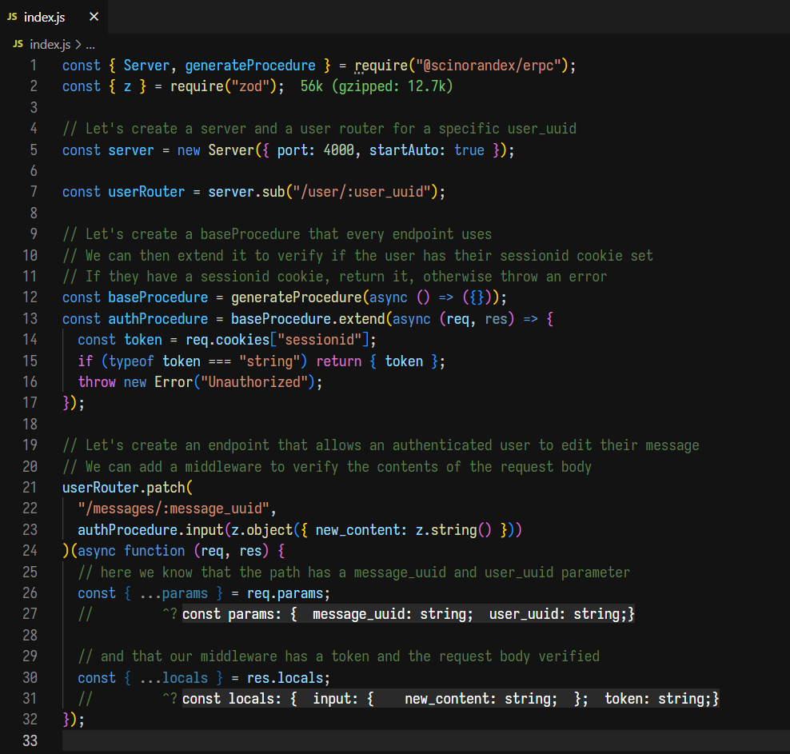

# @scinorandex/erpc 

A type-safe framework for building declarative Express APIs.

It copies the backend developer experience of tRPC and allows you to write API endpoints that know the context of their middleware and request path.

It also contains quality of life features such as `body-parser` and `cookie-parser` enabled by default, and cors support.

## Demo

